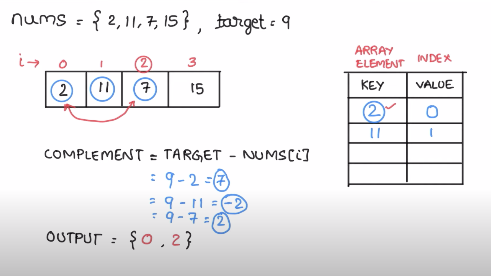

# Blind75prep
Practice Blind 75 and few other imp concepts

# Two Sum Problem

## Problem Description

Given an array of integers `nums` and an integer `target`, return indices of the two numbers such that they add up to `target`.

You may assume that each input would have exactly one solution, and you may not use the same element twice.

You can return the answer in any order.

**Example 1:**
Input: `nums = [2,7,11,15]`, `target = 9`
Output: `[0,1]`
Explanation: Because `nums[0] + nums[1] == 9`, we return `[0, 1]`.

**Example 2:**
Input: `nums = [3,2,4]`, `target = 6`
Output: `[1,2]`

**Example 3:**
Input: `nums = [3,3]`, `target = 6`
Output: `[0,1]`

---

## Solution Approach

The core idea is to efficiently find the "complement" of each number in the array. If `num` is the current number and `target` is the desired sum, the complement is `target - num`.

We can use a **hash map (or dictionary)** to store numbers we've encountered so far, along with their indices. This allows for `O(1)` average time complexity lookups.

**Algorithm Steps:**

1.  Initialize an empty hash map `num_map`.
2.  Iterate through the `nums` array with both the index `i` and the value `num`.
3.  For each `num`:
    * Calculate `complement = target - num`.
    * Check if `complement` exists as a key in `num_map`.
        * If it does, we've found our two numbers! Return `[num_map[complement], i]`.
    * If `complement` does not exist in `num_map`, add the current `num` and its index `i` to the `num_map`.

### Visual Explanation

Here's a diagram illustrating the process:

*(Ensure your `Images` folder is in the same directory as this Markdown file, and the `2-sum.png` file is inside it.)*

# --- Example Usage ---
# sol = Solution()

# print(f"Example 1: {sol.twoSum([2,7,11,15], 9)}")  # Expected: [0, 1]
# print(f"Example 2: {sol.twoSum([3,2,4], 6)}")      # Expected: [1, 2]
# print(f"Example 3: {sol.twoSum([3,3], 6)}")        # Expected: [0, 1]
