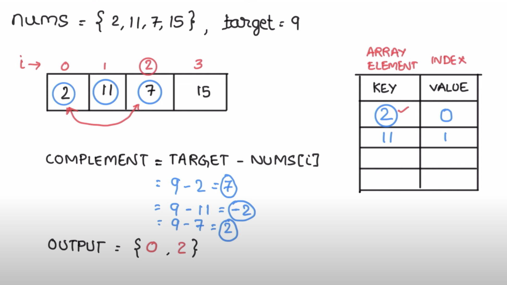

## 🧠 Two Sum Problem – Enhanced Explanation

> Given an array of integers `nums` and an integer `target`, return **indices** of the two numbers such that they add up to `target`.

---

### 📋 Problem Statement

You may assume:
- Each input has **exactly one solution**
- You **may not** use the same element twice
- You can return the answer in **any order**

---

### 🔍 Examples

#### ✅ Example 1:
```
Input: nums = [2,7,11,15], target = 9
Output: [0,1]
Explanation: Because nums[0] + nums[1] == 9, we return [0, 1]
```

#### ✅ Example 2:
```
Input: nums = [3,2,4], target = 6
Output: [1,2]
```

#### ✅ Example 3:
```
Input: nums = [3,3], target = 6
Output: [0,1]
```

---

### 💡 Intuition

We need to find **two numbers** such that:
```python
nums[i] + nums[j] == target
```

Instead of checking every pair (O(n²)), we use a **HashMap** to reduce the time to **O(n)**.

---

### 🛠️ Algorithm (with HashMap)

1. Iterate through the array
2. For each number `num`, calculate the complement:
   ```python
   complement = target - num
   ```
3. Check if the complement already exists in the map:
   - ✅ If yes → return its index and current index
   - ❌ If not → store `num` in the map with its index

---

### 🧾 Dry Run (Example: `[2, 7, 11, 15]`, `target = 9`)

| i | num | target - num | HashMap         | Output     |
|---|-----|---------------|------------------|------------|
| 0 | 2   | 7             | `{2: 0}`         | –          |
| 1 | 7   | 2 ✅          | `{2: 0}`         | `[0, 1]` ✅ |
|   |     |               |                  |            |

---

### 📊 Time & Space Complexity

| Type         | Complexity  |
|--------------|-------------|
| Time         | O(n)        |
| Space        | O(n)        |

---

### 🖼️ Diagram




